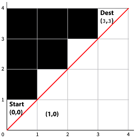

# Number-of-Paths
You start from bottom-left corner of an n×n grid, and go to top-right corner of the grid. Given n, the size of the grid’s axes, write a function numOfPathsToDest that returns the number of the possible paths you can take.

The car may move only in the white squares

Each square in the grid is represented as a pair (i,j). The first coordinate denotes the horizontal axis, and the second coordinate denotes the vertical axis. The initial state of the car is (0,0), and the destination is (n-1,n-1).

You must abide by the following two rules: 
1. you cannot cross the diagonal border. In other words, in every step the position (i,j) needs to maintain i >= j. See the illustration above for n = 5.
2. In every step, it may go one square up, or one square right, but not both. E.g. if the car is at (3,1), it may go to (3,2) or (4,1).

Time complexity should be O(n^2). Space complexity O(n).

Example:
input:  n = 4
output: 5 
  Since there are five possibilities: “LLLUUU”, “LLULUU”, “LULLUU”, “LULULU”, “LLUULU”
